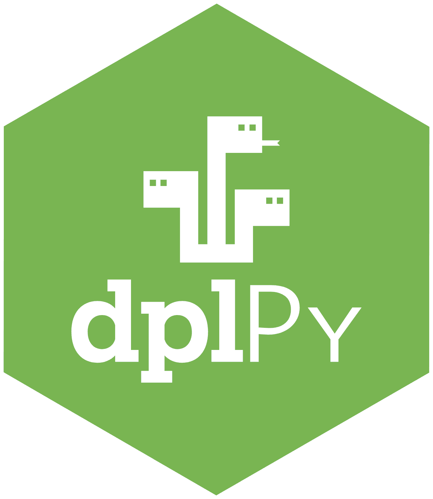

 <p align="center">
  

# dplPy -the Dendrochronology Program Library in Python
The Dendrochronology Program Library (DPL) in Python has its roots in both the [original FORTRAN program](https://www.ltrr.arizona.edu/software.html) created by the [legendary Richard Holmes](https://arizona.aws.openrepository.com/handle/10150/262569?show=full) and the subsequent R Project package by Andy Bunn, [dplR](https://github.com/OpenDendro/dplR).  Our aim is to provide researchers working with tree-ring data the necessary tools in open-source environments, promoting open science practices, enhancing rigor and transparency in dendrochronology, and eventually allowing reproducible research entirely in a single programming language.

 The development of dplPy is supported by a grant from the Paleoclimate program of the US National Science Foundation (AGS-2054516) to Andy Bunn, Kevin Anchukaitis, Ed Cook, and Tyson Swetnam.
<br>


---


## Index

- [dplPy - the Dendrochronology Program Library in Python](#dplpy---the-dendrochronology-program-library-in-python)
  - [Index](#index)
  - [Requirements](#requirements)
  - [Current Version and Changelog](#current-version-and-changelog)
  - [Installation](#installation)
  - [Building directly from Github](#building-directly-from-github)
  - [Using VSCode in your operating system](#using-vscode-in-your-operating-system)
    - [Linux or MacOS](#linux-or-macos)
    - [Windows](#windows)
  - [Functionalities and Usage](#functionalities-and-usage)
    - [Loading data using  `readers`](#loading-data-using--readers)
    - [Data Summary from `summary`](#data-summary-from-summary)
    - [Data Stastics from `stats`](#data-stastics-from-stats)
    - [Data Report from `report`](#data-report-from-report)
    - [Plotting](#plotting)
    - [Detrending using `detrend`](#detrending-using-detrend)
    - [Autoregressive (AR) modeling](#autoregressive-ar-modeling)
    - [Build a chronology with `chron`](#build-a-chronology-with-chron)
    - [Crossdate with `xdate`](#crossdate-with-xdate)

---

## Requirements

- Python (>=3.10)
- Conda ([Anaconda](https://docs.anaconda.com/anaconda/install/index.html) or [Miniconda](https://docs.conda.io/projects/continuumio-conda/en/latest/user-guide/install/index.html))
- (Suggested) [Mamba](https://mamba.readthedocs.io/en/latest/installation.html)
- (Suggested) [VSCode](https://code.visualstudio.com/)

Under the hood, dplPy uses `numpy`, `pandas`, `matplotlib`, `statsmodels`, `scipy`, and `csaps`.

:warning: dplPy has been successfully tested thus far on Ubuntu 20, Ubuntu 22, macOS (Intel and M2). Other operating systems may experience unexpected errors or conflicts.  Please let the developers know. 

## Current Version and Changelog

dplPy is currently at version `v0.1.2` - The project is changing to a new development structure where all development will be on `main` and releases and updates to [Pypi](https://pypi.org/project/dplpy/) will be branched and tagged from `main`.

## Installation

dplPy is now available to [install via pip](https://pypi.org/project/dplpy/):

```
pip install dplpy
```

To ensure you have the latest version of dplPy installed, you can run:

```
pip install dplpy --upgrade
```


You can install a conda virtual environment using the [environment.yml for the project](https://github.com/OpenDendro/dplPy/blob/main/environment.yml):

```
$ conda env create -f environment.yml     
```

---


## Building directly from Github

You can still still install dplPy firectly from Github if you wish:

1\. Clone and change directory to this repository


```
$ git clone https://github.com/OpenDendro/dplPy.git
$ cd dplPy
```

2\. Create a conda environment through the `environment.yml` file. This will ensure all packages required are installed.

```
$ conda env create -f environment.yml     

# if you have mamba installed you could instead do

$ mamba env create -f environment.yml
```

When prompted for permission to install required packages (with `y/n`), select `y`.

3\. Activate your environment:

```
$ conda activate dplpy
```

Your environment should be successfully built.

4\. Your python environment should be able to import `numpy`, `pandas`, `matplotlib`, `statsmodels` and `csaps`.

---

## Using VSCode in your operating system

### Linux or MacOS

1\. In your VSCode terminal, activate the conda environment with `conda activate dplpy3`.

2\. Open a Jupyer Notebook (`<file>.ipynb`) and select the `dplpy3` Kernel when prompted (or from the top right of your screen). This will automatically load the environment we created.

### Windows

In VSCode:

1\. In your VSCode terminal window, activate the conda environment with `conda activate dplpy3`.

2\. In the same terminal window, start a Jupyter Notebook with `jupyter notebook`. Jupyter will then return URLs that you can copy; *Copy* one of these URLs. 

3\. Open a Jupyter Notebook (`<file>.ipynb`) and from the **bottom right** of the VSCode screen, click **Jupyter Server**;

 

A dropdown menu will open from the top of the screen: select Existing and *paste* the URL you copied.


4\. Jupyter Notebook will now be able to access the environment created.

---

## Functionalities and Usage

Import the dplPy tool with

```
import dplpy as dpl
```

or alternatively:

```
import dplpy 
```
  
This will load the package and its functions.


### Loading data using  `readers`

- Description: reads data from supported file types (`csv` and `rwl`) and stores them in a dataframe.
- Options: 
    - `header`: input files often have a header present; Default is `False`, use `True` if input has a header.
- Usage example:
    ```
    >>> data = dpl.readers("/path/to/file.rwl", header=True)
    ```

### Data Summary from `summary`

- Description: generates a summary of each series recorded in `rwl`  and `csv` format files
- Usage Example:
    ```
    >>> dpl.summary("/path/to/file.rwl")
    # or
    >>> dpl.summary(data)
    ```

### Data Stastics from `stats`

- Description: generates summary statistics for `rwl`  and `csv` format files
- Usage Example:
    ```
    >>> dpl.stats("/path/to/file.rwl")
    # or
    >>> dpl.stats(data)
    ```

### Data Report from `report`

- Description: generates a report about absent rings in the data set
- Usage Example:
    ```
    >>> dpl.report("/path/to/file.rwl")
    # or
    >>> dpl.report(data)
    ```

### Plotting

- Description: generates plots of tree ring with data from dataframes. Currently capable of generating `line` (default), `spag` (spaghetti) and `seg` (segment) plots.
- Options:
    - `type="line"`: creates a line plot (default)
    - `type="spag"`: creates a spaghetti plot
    - `type="seg"`: creates a segment plot
- Usage Example:
    ```
    >>> dpl.report("/path/to/file.rwl")
    # or 
    >>> dpl.plot(data)

    # User is able to select specific series of interests.
    # In the example below, the user selects SERIES_1, SERIES_2, SERIES_3 
    # from the "data" dataset and generates a spaghetti plot
    >>> dpl.plot(data[[SERIES_1, SERIES_2, SERIES_3]], type="spag")
    ```

### Detrending using `detrend`
 
- Description: Detrends a given series or data frame, first by fitting data to curve(s), and then by calculating residuals or differences compared to the original data.
- Options:
    - `fit="spline"`: default detrending method.
    - `fit="ModNegEx"`: detrending using negative exponent method.
    - `fit="Hugershoff"`: detrending using the Hugenshoff method.
    - `fit="linear"`: detrending using the linear method.
    - `fit="horizontal"`: detrending using the horizontal method.
    - `method="residual"`: calculates residuals vs original data (default).
    - `method="difference"`: calculates differences vs original data.
    - `Plot`: plotting results default is `True`, accepts `False`.
- Usage Example:
    ```
    >>> dpl.detrend(data)
    # or
    >>> dpl.detrend(data, fit="Hugershoff", method="difference")

    # User is able to select specific series of interests.
    >>> dpl.detrend(data[[SERIES_1, SERIES_2, SERIES_3]], fit="Hugershoff", method="difference")
    ```


### Autoregressive (AR) modeling 

- Description: ontains methods that fit series to autoregressive models and perform functions related to AR modeling.
- Functions:
    - `autoreg(data['Name of series'], max_lag)`: returns parameters of best fit AR model with maxlag of 5 (default) or other specified number
    - `ar_func(data['Name of series'], max_lag)`: returns residuals plus mean of best fit from AR models with max lag of either 5 (default) or specified number
- Options:
    - `max_lag`: default 5, can be specified to user's needs.
- Usage Example:
    ```
    >>> dpl.autoreg(data[SERIES_1])
    # or
    >>> dpl.ar_func(data[SERIES_2], max_lag=7)
    ```

### Build a chronology with `chron`

- Description: creates a mean value chronology for a dataset, typically the ring width indices of a detrended series. **Note: input data has to be detrended first.**
- Options:
    - `biweight`: find means using Tukey's biweight robust mean; default `True`.
    - `prewhiten`: prewhitens data by fitting to an AR model; default `False`.
    - `plot`: plots results; default `True`.
- Usage Example:
    ```
    # Detrend data first!
    >>> rwi_data = dpl.detrend(data)

    # Perform chronology
    >>> dpl.chron(rwi_data, biweight=False, plot=False)
    ```
### Crossdate with `xdate`
- Description: evaluate the dating accuracy of a set of tree-ring measurements
- Options: 
