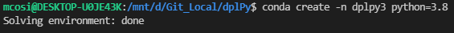
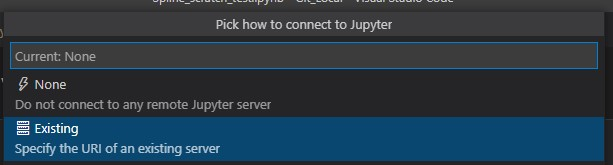

# dplPy
The Dendrochronology Program Library for Python

## Issues

We're using [ZenHub](https://app.zenhub.com/workspaces/opendendro-60ec698d8790d700171ceee8/board?repos=385244315) to manage our [GitHub Issues](https://github.com/opendendro/dplpy/issues)

## Building Environment

> :warning: **it is recommended to _NOT_ use GitHub Codespaces (as of Mar 2022)**

> :warning: **Prior to creating an enviroment, ensure that you are outside of `base` by doing `conda deactivate`.**

1\. Create a conda environment with python version 3.8 as default python:

```
conda create -n dplpy3 python=3.8
```



When prompted for permission to install required packages (with `y/n`), select `y`. Upon finishing installing the required packages, reload your terminal (close and re-open terminal).

> :warning: **If terminal shows you are in `base`, exit with `conda deactivate`.**

2\. Activate your environment:

```
conda activate dplpy3
```

From within your environment, install [CSAPS](https://pypi.org/project/csaps/#description):

```
pip install -U csaps
```

Update your environment:

```
conda env update -f environment.yml --prune
```


Your environment should be successfully built.

3\. Your python environment should be able to import `numpy`, `pandas`, `matplotlib`, `statsmodels` and `csaps`:


## Using Jupyter

The Conda enviroment is essential as it provides will all necessary packages. To execute the code, use Jupyter Notebook.

### Linux, MacOS

1\. In your VSCode terminal, activate the conda environment with `conda activate dplpy3`.
2\. Open a Jupyer Notebook (`<file>.ipynb`) and select the `dplpy3` Kernel when prompted (or from the top right of your screen).
This will automatically load the environment we created.

### Windows

In VSCode:

1\. In your VSCode terminal window, activate the conda environment with `conda activate dplpy3`.
2\. In the same terminal window, start a Jupyter Notebook with `jupyter notebook`. Jupyter will then return URLs that you can copy; *Copy* one of these URLs. 


3\. Open a Jupyter Notebook (`<file>.ipynb`) and from the **bottom right** of the VSCode screen, click **Jupyter Server**;

 

A dropdown menu will open from the top of the screen: select Existing and *paste* the URL you copied.



4\. Jupyter Notebook will now be able to access the environment created.
