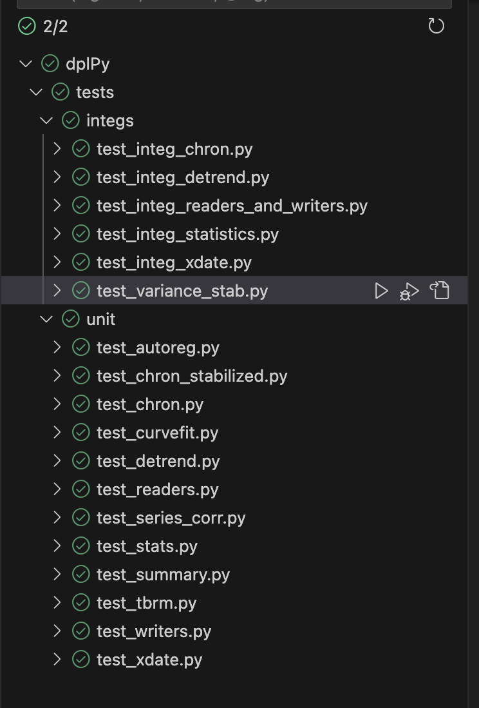

# dplPy Developer Instructions (in progress)

Welcome to the dplPy developer manual. We welcome all code contributions, bug reports, bug fixes, documentation improvements, and suggestions.

## Environment setup

### 1. GitHub setup

#### 1.1 Create dplPy fork in github

You will need your own copy of dplpy to work on the code. Go to the dplPy github page and click the fork button. Make sure the option to copy only the main branch is unchecked.


#### 1.2 Create local repository
In your local terminal, clone the fork to your computer using the commands shown below. Replace {your-user} with your github username.
```
$ git clone https://github.com/{your-user}/OpenDendro/dplPy.git dplpy-{your-user}
$ cd dplpy-{your-user}
git remote add upstream https://github.com/OpenDendro/dplPy.git
git fetch upstream
```

This creates a github repository in dplPy-{your-user} on your computer and connects the repository to your fork, which is now connected to the main dplPy repository.

#### 1.3 Create feature branch

First, ensure that the main branch of your fork is up-to-date with the main dplpy repository:

```
git checkout main
git pull upstream main --ff-only
```

Then, create a new branch for making your changes, with the command below (Replace {feature_name} with the name of your feature or preferred branch name).

```
git checkout -b {feature_name}
```

### 2. Conda environment

The packages required to run dplPy are all specified in environment.yml. 

#### 2.1\. Create your environment with the required packages installed.

If you're using conda, run

```
$ conda env create -f environment.yml 
```

If you're using mamba, run

```
$ mamba env create -f environment.yml
```

If prompted for permission to install requred packages, select y.

#### 2.2\. Activate your environment. 
You will need to have the conda environment activated anytime you want to test code from the package.

```
conda activate dplpy
```

After running this command, you should see (dplpy) on the left of each new line in the terminal.

#### 2.3\. Run unit and integration tests to ensure that installation was successful.

With the conda environment activated, run `pytest` in the project's home directory to run all tests. 

To run only the unit tests, specify to run tests in the unit tests folder as shown below

```
pytest tests/unit --cov=dplpy
```
Note: The --cov option displays coverage information for all code files

To run the integration tests, run `pytest` while specifying that only tests from the integ tests folder should be run. Run pytest with -r set to A to include a summary of all tests run at the end, which can be useful for quickly pointing out issues for further analysis.


```
pytest tests/integs -rA
```

### 3. IDE setup

We recommend using VSCode for development. The following instructions show how to set up VSCode to recognize the conda environment and debug tests.

#### 3.1\. Open the dplpy folder in VScode
In VSCode, open the folder containing your local dplpy repository. If you followed the instructions above, this should be a folder named `dplpy-{your-github-username}`. Then, open the file `src/dplpy.py`.

#### 3.2\. Change the python interpreter to use the conda environment's interpreter
In the bottom corner of your IDE display, select the language interpreter.

Choose the interpreter `Python 3.x ('dplpy')`, with a path that ends with `/envs/dplpy/python`.

Now you should be able to run any python files within the currently open folder with the run button in VSCode, instead of running them through the terminal. 

Note: If the terminal is opened after the interpreter has been set to use the conda environment, conda activate dplpy will automatically be run and does not need to be run again.

#### 3.3\. Set up testing tools

Go to the testing tab (on the left side of the VSCode display). With your environment set. If the tests are not automatically discovered, open `.vscode/settings.json` and add the following lines inside the curly braces, so that your file looks like this:

```
{
    // any pre-existing configurations (DO NOT ADD THIS, THIS REPRESENTS ANYTHING ALREADY IN THE FILE)

    "python.testing.pytestArgs": [
        "./tests"
    ],
    "python.testing.unittestEnabled": false,
    "python.testing.pytestEnabled": true
}
```

If `.vscode/settings.json` has not been created, create it and add the lines shown above.

Go back to the testing tab and verify that the dplpy unit tests are showing. They should look like this:




Run the tests by clicking the play button to the right of `tests`.

#### 3.4\. Updating dev environment with changes from main dplpy repository
It is important to frequently update your local `main` with any changes to the remote dplpy `main` repository. To do this, run the following commands:

```
git checkout main
git merge upstream/main
```


## Making Changes and Submitting a Pull Request
### 1. Commit and Push Changes to Feature Branch
#### 1.1 View and stage changes
Run `git status` in the terminal to view all your uncommitted changes.

Stage changes for commit by running `git add` as shown below:

```
# to add all files in current directory
git add .

# to add specific folder/files from current directory
git add {folder_name}
```

#### 1.2 Commit and push changes
Note: Make sure to test your changes before commiting them.

When you're ready, commit your staged changes as shown below. You must add a commit message.
```
git commit -m "Your commit message goes here"
```

You can push your commits to your forked repository's remote branch by running

```
git push origin {branch_name}
```

Your code is now on GitHub, but for it to be part of the main dplpy repository, you need to create a pull request. 

Note: Before creating a pull request, wait for your changes to be tested by our workflow that runs unit and integ tests in all supported versions of python. You can check on the status of the all workflows by navigating to the Github page of your remote branch, and clicking the status indicator to the right of the most recent commit message. This shows a check mark if all workflows ran successfully, an X if any of them failed, and an orange dot if workflows are still running.

### 2. Creating and Submitting a Pull Request

#### 2.1 Create pull request
Navigate to your forked dplpy repository on Github, and in the pull requests tab, create a new pull request.

Note: If you recently pushed changes to a branch other than main, you will sometimes be shown the option to immediately compare and make a pull request to main. This works too.

#### 2.2 Review Changes and Submit PR
Pull requests allow you to view a side-by-side diff comparison of all changed files. Review all changes to ensure correctness.

If you are satisfied with your changes, give the PR a descriptive title, and specify in the description what changes were made and what (if any) issues were addressed. Then, submit the pull request.

Your request will be reviewed by the repository maintainers.