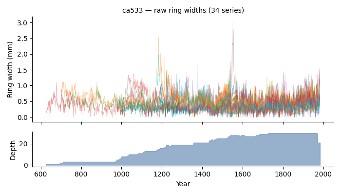
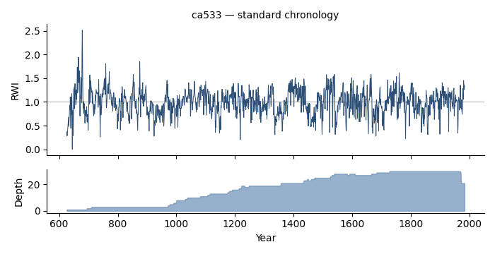

# Quickstart

This walkthrough takes a raw ring-width file all the way to a crossdated site
chronology. It uses `ca533.rwl` (Campito Mountain bristlecone pine), one of the
classic dplR/ITRDB example collections. Every code block shows real dplPy
output.

## 1. Load ring widths

```python
import dplpy as dpl

rwl = dpl.readers("ca533.rwl", header=True)
```

```text
ca533.rwl successfully extracted as rwl file with 34 series covering the period from 626 to 1983
```

`readers` returns a pandas `DataFrame` indexed by year, one column per series:

```python
rwl.shape          # (1358, 34)  -> 1358 years, 34 series
```



## 2. Inspect the data

```python
dpl.stats(rwl).head(3)
```

```text
   series  first  last  year   mean  median  stdev   skew  kurtosis   gini    ar1
1  CAM011   1530  1983   454  0.440    0.40  0.222  1.029     1.102  0.273  0.696
2  CAM021   1433  1983   551  0.424    0.40  0.185  0.946     1.110  0.237  0.701
3  CAM031   1356  1983   628  0.349    0.29  0.214  0.690    -0.366  0.341  0.808
```

## 3. Detrend (standardize)

Remove each series' biological growth trend to produce ring-width index (RWI)
series. The default is a smoothing spline:

```python
rwi = dpl.detrend(rwl, fit="spline")
```

See [Detrending & standardization](../guide/detrending-standardization.md) for
the other curves (`ModNegExp`, `ModHugershoff`, `Mean`, `AgeDepSpline`) and the
`rcs`, `ssf`, `ads`, and `powt` methods.

## 4. Build a chronology

Average the detrended series into a site chronology. By default this is a
Tukey's-biweight robust mean with a sample-depth column:

```python
crn = dpl.chron(rwi)
crn.tail(3)
```

```text
           std  samp_depth
Year
1981  1.252329          21
1982  1.362052          21
1983  1.314605          21
```



For AR-modelled or variance-stabilized chronologies, see
[Building chronologies](../guide/chronologies.md).

## 5. Crossdate

`xdate` correlates each series, segment by segment, against a leave-one-out
master to flag possible dating problems. It returns a dictionary of per-segment
correlations and flags:

```python
result = dpl.xdate(rwl)          # dplR-faithful default
result["seg_corr"]               # per-series, per-segment correlations
```

For a COFECHA-style run and a full formatted report, use the COFECHA preset and
`xdate_report`:

```python
report = dpl.xdate_report("ca533.rwl", preset="COFECHA")
```

The [Crossdating & COFECHA](../guide/crossdating.md) guide covers flags, segment
settings, the COFECHA emulation, and dating floating series with
`xdate_floater`.

## Where to go next

- [Reading & writing data](../guide/reading-writing-data.md)
- [Coming from dplR](../guide/coming-from-dplr.md) — a function-by-function map
- [API Reference](../reference/io.md)
